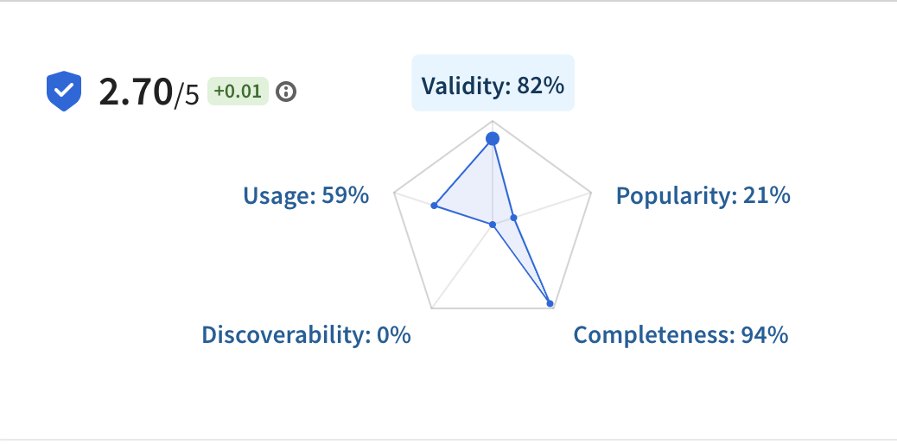
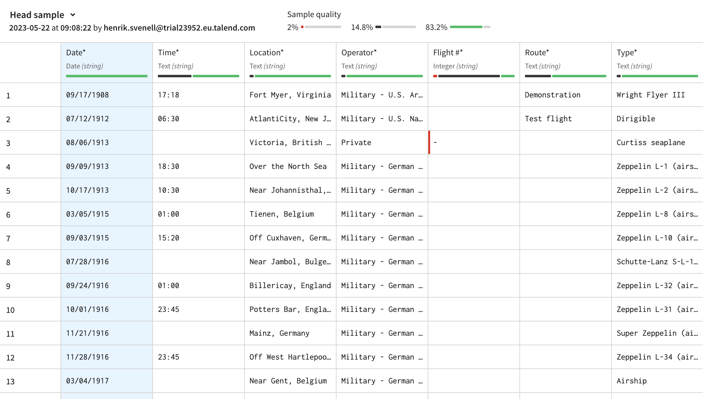
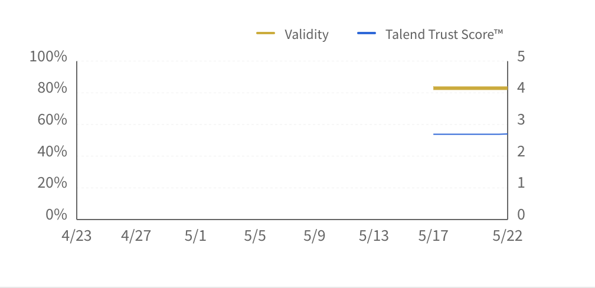
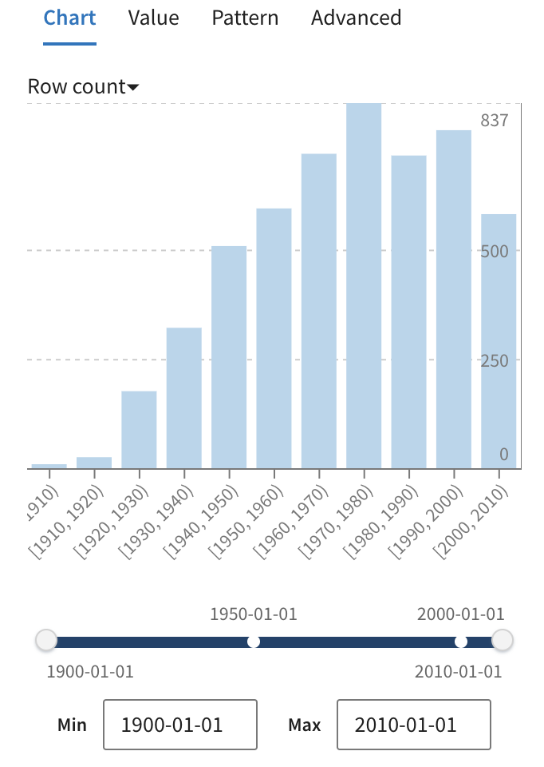

# Talend

Uses:

- Pendo
- Launch darkly
- scim (read more about)

## Data Inventory

- One dataset per table, for excel files there will be multiple datasets.
- Supports head and random samples
- Extended [classification](./dataset/classification.md) information
- Statistics ~ the same but Talend have variance + [medcouple](https://en.wikipedia.org/wiki/Medcouple)

### [api/v1/datastores](./datastore/datastores.json)

Lists available data stores

### [api/v1/datastores/:id](./datastore/datastore_id.json)

### [api/v1/datasets](./dataset/datasets.json)

Information on:

- dataset metadata
  - name
  - owner
  - sharing information
  - entitlements
- trust score

### [api/v1/datasets/:id/attributes](./dataset/dataset-attributes.json)

### [api/v1/datasets/:id/metadata](./dataset/dataset-metadata.json)

### [api/v1/dataset-samples/:id](./dataset/dataset-samples.json)

Sample data is either random or head sample. Shows semantic classification and data quality score.

### [api/v1/datasets/trust-score/composite-history](./dataset/trust-score-composite.history.json)

Shows history of how the trust score changed over time

## Data preparation

### [api/preparations/:id/details](./dataprep/dataprep-details.json)

Information on the data prep actions that is added for the dataset

### [api/preparations/:id/content](./dataprep/dataprep-content.json)

Content of the dataset after dataprep actions have been performed.

### [api/v2/preparations/:id/steps/:stepId](./dataprep/dataprep-stepid.json)

Returns details of a transfomrations step.

### [api/preparations/:id/steps/:stepId/columns/:columnId/statistics](./dataprep/statistics.json)

Column statistics:

- Pattern frequency
- Histogram information

### api/export/formats/preparations/:id

### transform/preparations/functions/mapping

### transform/preparations/:id/runs

### transform/preparations/:id/columns/mapping-tck

### transform/preparations/:id/rowmetadata/validity

### tacokit/:id/functions

## Streams/Pipeline

### [api/v1/streams/:id](./streams/streams-id.json)

Information on the current pipeline

This example uses:

- 2 datasets as inputs from 2 different datastores
- Produces 1 dataset

Payload:

- List of datasets (3)
- List of datastores (2)
- Runtime metrics
- Pipelines
  - Components - list of the nodes with graphicalAttributes
    - source - local storage
    - source - datastore-connector
    - processor - left outer join
    - sink - local storage
  - Ports - incomming and outgoing endpoints to the nodes
  - Steps - edges between the nodes
    - sourceId - source port
    - targetId - target port

### [api/v1/streams/:id/processors](./streams/streams-id-processor.json)

Information on the current processors

### api/v1/streams/pipelines/:id/previews/:previewId/ports/:portId/schema

### api/v1/streams-cloud-agents

## SCIM

### api/v1/scim/me

Returns info about the user:

- Applications assigned
- Email and display names
- List of entitlements:
- Roles
- Metadata

### api/v2/scim/accounts/current

### api/v1/iam-server/application-details

Gets URL to the assigned applications

### api/v1/scim/Users

### api/v1/scim/Groups

### api/user

## Other

### api/v1/facets

### api/v1/crawlers

### api/v1/semantic/categories

### api/v1/rules
